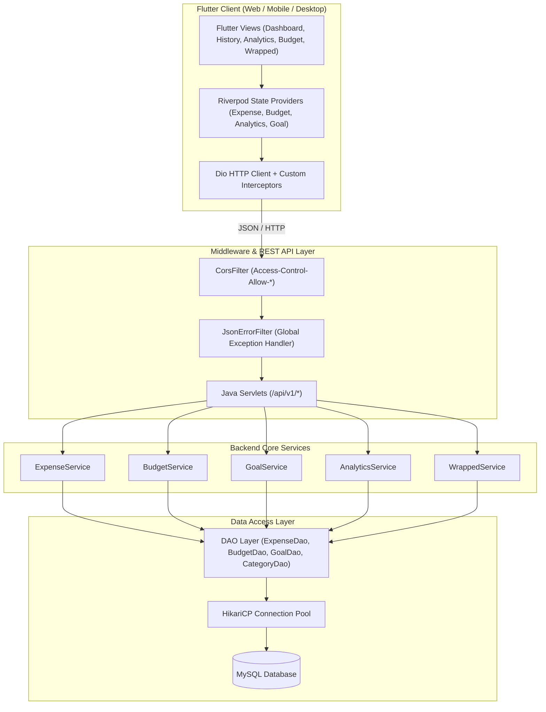
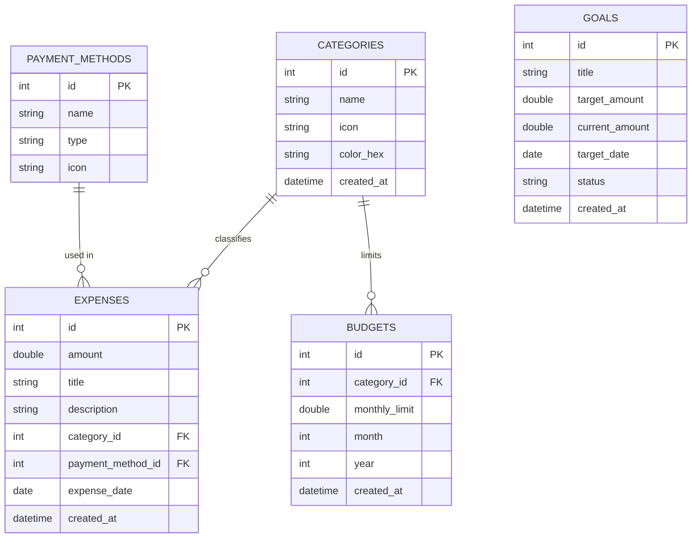

# 💳 Intelligent Personal Expense Tracker

[](https://flutter.dev)
[](https://www.oracle.com/java/)
[](https://www.mysql.com/)
[](https://riverpod.dev)
[](LICENSE)

An enterprise-grade, full-stack Personal Expense & Budget Management System featuring a modern **Flutter** frontend, robust **Java Servlet** backend API, **HikariCP** database connection pooling, and **MySQL** persistence. Designed with an *"Intelligent Insight"* dark aesthetic, responsive interactive charts, real-time budget velocity tracking, and an annual/monthly "Expense Wrapped" story experience.

---

## 🌟 Key Features

- 📊 **Interactive Analytics Dashboard**: Real-time spending breakdown with dynamic Donut Charts, category breakdowns, and financial health badges.
- 💸 **Transaction Tracking & History**: Filter, search, and manage income/expenses with payment method metadata (Credit Card, UPI, Cash, Bank Transfer).
- 🎯 **Smart Budgeting & Alerts**: Category-wise monthly budget caps with percentage progress indicators and over-budget velocity warnings.
- 🏆 **Savings Goals Tracker**: Define financial targets (e.g., Emergency Fund, Vacation) with target dates, target amounts, and auto-calculated monthly contribution recommendations.
- 🎁 **Expense Wrapped (Story View)**: A Spotify Wrapped-style interactive story detailing top spending categories, highest spending month, total transactions, and financial personality insights.
- 📅 **Calendar Heatmap**: Visual GitHub-style heatmap highlighting daily spending density over time.
- ⚡ **High-Performance Backend**: Built with pure Java Servlets, Jackson JSON processing, HikariCP connection pooling, and custom CORS filter middleware.

---

## 🏗️ System Architecture



---

## 🗄️ Entity-Relationship (ER) Diagram



---

## 🌐 API Routing Matrix

| Endpoint | Method | Description | Request Payload / Params |
| :--- | :---: | :--- | :--- |
| `/api/v1/expenses` | `GET` | Fetch filtered expense list | `?startDate=&endDate=&categoryId=` |
| `/api/v1/expenses` | `POST` | Create a new expense entry | `{ title, amount, categoryId, date, ... }` |
| `/api/v1/expenses` | `DELETE` | Delete expense entry by ID | `?id={id}` |
| `/api/v1/budgets` | `GET` | List budget limits and progress | `?month=&year=` |
| `/api/v1/budgets` | `POST` | Create or update budget cap | `{ categoryId, monthlyLimit, month, year }` |
| `/api/v1/goals` | `GET` | Fetch all savings goals | N/A |
| `/api/v1/goals` | `POST` | Add or edit savings goal | `{ title, targetAmount, targetDate }` |
| `/api/v1/analytics` | `GET` | Category & monthly trend analytics | `?period=monthly` |
| `/api/v1/dashboard` | `GET` | Consolidated dashboard overview | N/A |
| `/api/v1/wrapped` | `GET` | Get annual/monthly Expense Wrapped story | `?year=2026` |

---

## 📁 Repository Structure

```
EXPENSE_TRACKER/
├── .gitignore
├── README.md
├── app/                          # Flutter Frontend Project
│   ├── pubspec.yaml              # Dependencies & Assets
│   ├── lib/
│   │   ├── main.dart             # Application Entrypoint & Theme Config
│   │   ├── models/               # Dart Data Models (Expense, Budget, Goal, Insight)
│   │   ├── services/             # Dio API Services (Expense, Analytics, Budget)
│   │   ├── state/                # Riverpod Providers & State Notifiers
│   │   ├── screens/              # UI Views (Dashboard, History, Analytics, Budget, Goals, Wrapped)
│   │   └── widgets/              # Reusable UI Components (Charts, Shimmers, Heatmaps)
│   └── test/
└── backend/                      # Java Backend Project
    ├── pom.xml                   # Maven Build Dependencies
    ├── sql/
    │   └── schema.sql            # Database Creation & Seeding Script
    └── src/
        └── main/
            ├── java/com/expensetracker/
            │   ├── App.java      # Server Runner / Entrypoint
            │   ├── config/       # HikariCP & App Configuration
            │   ├── dao/          # Data Access Objects (JDBC Query Execution)
            │   ├── filter/       # CORS & Exception Handling Filters
            │   ├── model/        # Java DTO Models
            │   ├── service/      # Business Logic Services
            │   ├── servlet/      # Jakarta Servlet Controllers
            │   └── util/         # JSON Serialization & Date Helpers
            └── resources/
                └── db.properties # Database Credentials & Pool Settings
```

---

## 🚀 Setup & Installation Guide

### Prerequisites
- **Java Development Kit (JDK)**: 17+ or 21
- **Apache Maven**: 3.8+
- **Flutter SDK**: 3.19+
- **MySQL Server**: 8.0+

---

### 1. Database Setup

1. Launch MySQL Server locally.
2. Execute the schema migration and seeding script:

```bash
mysql -u root -p -e "source a:/EXPENSE_TRACKER/backend/sql/schema.sql"
```

---

### 2. Backend Service Configuration & Execution

1. Navigate to the `backend` directory:
   ```bash
   cd backend
   ```
2. Verify or update database credentials in `src/main/resources/db.properties`:
   ```properties
   db.url=jdbc:mysql://localhost:3306/expense_tracker?useSSL=false&allowPublicKeyRetrieval=true&serverTimezone=UTC
   db.user=root
   db.password=YOUR_MYSQL_PASSWORD
   ```
3. Compile and launch the backend server:
   ```bash
   mvn clean compile exec:java
   ```
   *The REST API will listen on `http://localhost:8080/api/v1`.*

---

### 3. Flutter Frontend Execution

1. Navigate to the `app` directory:
   ```bash
   cd app
   ```
2. Install dependencies:
   ```bash
   flutter pub get
   ```
3. Launch application (Web / Desktop / Emulator):
   ```bash
   # Run on Chrome Browser
   flutter run -d chrome --dart-define=API_BASE_URL=http://localhost:8080/api/v1

   # Run on Windows Desktop
   flutter run -d windows --dart-define=API_BASE_URL=http://localhost:8080/api/v1
   ```

---

## 🛠️ Technology Stack

- **Frontend**: Flutter, Dart, Riverpod, Dio, fl_chart, flutter_heatmap_calendar, Google Fonts (Outfit / Inter)
- **Backend**: Java 21, Jakarta Servlets, Embedded Tomcat / HTTP Server, HikariCP JDBC Pool, Jackson JSON Databind
- **Database**: MySQL 8.x
- **Build Tool**: Apache Maven

---

## 📄 License

This project is open-source under the [MIT License](LICENSE).
